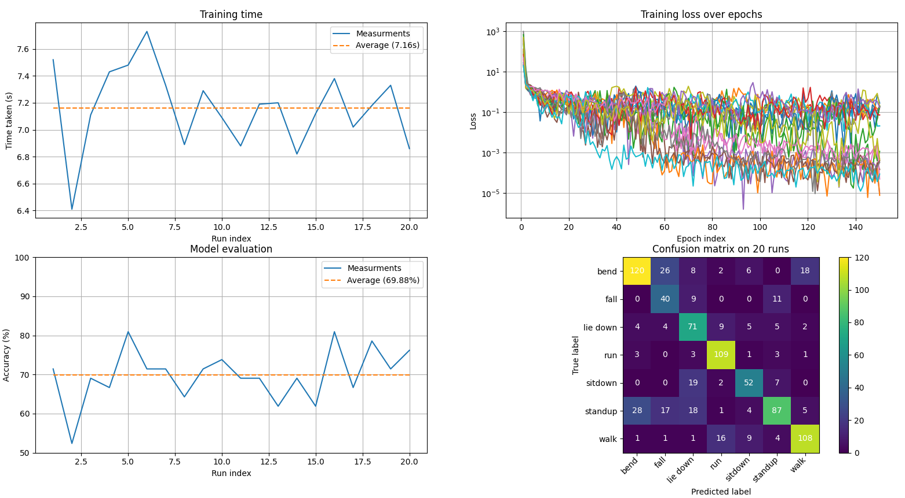

# Human Activity Recognition (HAR) Using WiFi CSI

This project focuses on **Human Activity Recognition (HAR)** using **Channel State Information (CSI)** extracted from WiFi signals. The primary goal of the current phase is to detect **whether a fall event has occurred or not**, using deep learning models.

---

## 🚀 Project Overview

Traditional HAR systems rely on wearable sensors or cameras. In contrast, this project explores a **device-free**, **privacy-preserving**, and **non-invasive** approach using WiFi signals. By analyzing variations in CSI, we aim to recognize human activities and, more specifically, detect falls with a certain accuracy.

Our approach uses:

* 📡 **WiFi Channel State Information (CSI)** as input features
* 🧠 **Convolutional Neural Networks (CNNs)** for acticity classification

---

## 🏗️ Current Features

* **CNN-Based Classifier**: A deep learning model trained to detect falls.
* **Activity Detection**: Output is one of the 7 activities : bend, fall, lie down, run, sit down, stand up and walk.

---

## 🧪 Methodology

### 1. **CSI Collection**

As this project aims on HAR, we will use free CSI database online. I found one [here](https://drive.google.com/drive/u/0/folders/1Qu8hfdQvygF1U0sB0MRdyLKCfbBiBRwp) which contains 7 different activities : bend, fall, lie down, run, sit down, stand up and walk.

### 2. **Data pre-processing**

The data available on the google drive is stored into CSV files. It needs to be in .pt files as it will be easier for us to import all data with pyTorch. The data is read from the CSV files, converted into pyTorch tensors, reshaped with `torch.nn.functional.adaptive_avg_pool2d` (into 64x64 or 52x600 images) and then splitted into training/testing data.

### 3. **Models Architecture**

This project is also a way to try and compare different models. I will then train and evaluate 12 different models, changing the number of convolutional layers, the number of fully connected layers and the input tensor shape.
In order to get good results on the models, I will make several runs of the same model (retrained, re-evaluated) and make an average score.

### 4. **Result storage**

After all the runs, the results are stored into JSON files, as it is easy, fast and easy to read. The JSON structure will be :
```
├── hyperparameters
│    ├── learning rate
│    ├── input shape
│    ├── number of epochs
│    ├── model name
│    ├── train batch size
│    ├── test batch size
│    ├── number of runs 
├── training results
│    ├── losses for each run
│    ├── training time for each run
└── test results
     ├── accuracy for each run
     └── confusion matrix for each run
```

### 5. **Results visualisation**

In order to view, plot and compare the different models, I need to use `matplotlib`. There will be two different data visualisation : 
* The first will show all information about one model : the training time, the loss, the accuracy and the confusion matrix



* The second will plot a graph with the information of different models : for example the training time for a model with 2, 3 or 4 convolutional layers

---

## 🔧 Requirements

* Python 3.9+
* Matplotlib
* scikit-learn
* pyTorch

Install dependencies:

```bash
pip install -r requirements.txt
```
